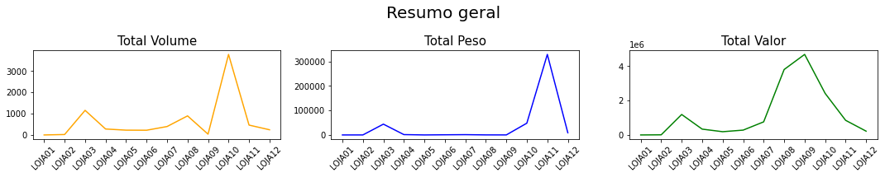

<h1 align="center">🐼Análise com Pandas e Gráficos com Matplotlib</h1>

 
 
 
## 🏷 Descrição 

Projeto com a finalidade de tratar os dados e gerar gráficos que mostram os resultados de faturamento e volume.
 

## 💻 Resultado

Projeto <a href="https://github.com/Reginaldo-projects/Analise_com_Pandas/blob/main/Modelagem%20com%20pandas%20Dash%20com%20Matplotlib.ipynb" target="_blank">aqui</a>.

 
 

Segue parte do código, para gerar um conjunto de gráficos.

 
<pre>
  <code>
volume = df.groupby('Lojas').sum()
volume = volume[['Volume']].sort_values(by="Lojas",ascending=True)
peso = df.groupby('Lojas').sum()
peso = peso[['Peso']].sort_values(by="Lojas",ascending=True)
total = df.groupby('Lojas').sum()
total = total[['Valor_Total']].sort_values(by="Lojas",ascending=True)
  cliente=df['Cliente'].unique()
    plt.figure(figsize=(15, 3))
    plt.suptitle('Resumo geral', fontsize= 20)
    plt.subplot(131)
    plt.title('Total Volume',fontsize= 15)
    plt.plot(volume.index, volume.values,color= 'orange')
    plt.xticks(rotation=45)
    plt.subplot(132)
    plt.title('Total Peso',fontsize= 15)
    plt.plot(peso.index, peso.values, color= 'blue')
    plt.xticks(rotation=45)
    plt.subplot(133)
    plt.title('Total Valor',fontsize= 15)
    plt.plot(total.index, total.values,color= 'green')
    plt.xticks(rotation=45)
      print('Total de clientes:')
      print(len(cliente))
      print("---"*40)
        plt.tight_layout()
        plt.show()

  </code>
</pre>
        Total de clientes:
         
30
 
------------------------------------------------------------------------------------------------------------------------
 

 

## 📌 Licença

## 👍Autor

<table>
  <tr>
    <td align="center">
      <a href="https://github.com/Reginaldo-projects">
         
        
          <b>Reginaldo Barbosa</b>
        
      </a>
    </td>
  </tr>
</table>
